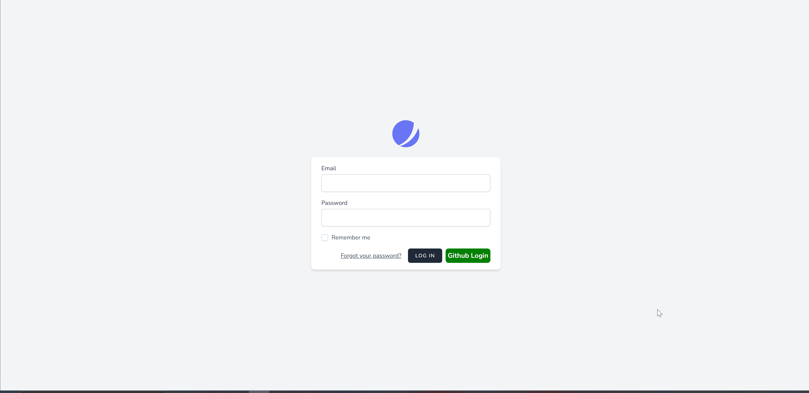

# Laravel Github Login Authentication System

## About Laravel

Laravel is a web application framework with expressive, elegant syntax. We believe development must be an enjoyable and creative experience to be truly fulfilling. Laravel takes the pain out of development by easing common tasks used in many web projects, such as:

Laravel is accessible, powerful, and provides tools required for large, robust applications.

## Plugin

Socialite, JetStream

## Instructions

GitHub’s OAuth implementation supports the standard authorization code grant type and the OAuth 2.0 Device Authorization Grant for apps that don’t have access to a web browser. If you want to skip authorizing your app in the standard way, such as when testing your app, you can use the non-web application flow.

Laravel 9 Socialite Login with Github Example
Use the following steps to login with github in laravel 9 apps:

-   Step 1 – Install Laravel 9 App
-   Step 2 – Configure Database With App
-   Step 3 – Configure Github App
-   Step 4 – Install Socialite & Configure
-   Step 5 – Add Field In Table Using Migration
-   Step 6 – Install Jetstream Auth
-   Step 7 – Make Routes
-   Step 8 – Create Controller By Command
-   Step 9 – Implement Github Login In Login Page
-   Step 10 – Start Development Server
Before start GitHub login integration in laravel 9 using socialite. So, we need to create a GitHub app by following the below steps:
-   1 – Vist this url [Developer](https://github.com/settings/developers) and then take GitHub app client id and secret.
-   2 – When you visit the above url, you will see like the following:
    `create github app`
-   3 – After login or signup in github.com, Then you will see like in the below picture. So, you need to click New Auth APP button. And Create your app:
create oauth app in github
-   4 – After that, Register a new OAuth application page will open. So fill your app detail and submit it, look like in below picture:
register oauth github app
-   5 – Finally, you will see dashboard of your created github app look like in below picture. So copy your github app details here:
        `get github app client id and secret`
-   Step 1 – Install Laravel 9 App
In this step, open your terminal and navigate to local web server directory. Then type the following command on terminal to download laravel 9 app:

composer create-project --prefer-dist laravel/laravel LaravelGithubLogin
-   Step 2 – Configure Database With App
Next step, navigate to root directory of download laravel app. And open .env file. Then configure database details like following:
 `DB_CONNECTION=mysql` 
 `DB_HOST=127.0.0.1` 
 `DB_PORT=3306` 
 `DB_DATABASE=here your database name here`
 `DB_USERNAME=here database username here`
 `DB_PASSWORD=here database password here`
-   Step 3 – Configure Github App
In this step, configure GitHub app with this laravel app. So, open your laravel Github social login project in any text editor. Then navigate the config directory and open service.php file and add the client id, secret and callback url:

 `'github' => [`
    `'client_id' => 'xxxx',`
    `'client_secret' => 'xxx',`
    `'redirect' => 'http://127.0.0.1:8000/callback/github',`
  `], `
-   Step 4 – Install Socialite & Configure
In this step, use the following command to install socialite package in laravel app:

`composer require laravel/socialite`
After that, configure this package in app.php file, so go to config directory and open app.php file.

Then Add the ServiceProvider in `config/app.php`:

`'providers' => [`
    `/*`
    ` * Package Service Providers...`
    ` */`
    `Laravel\Socialite\SocialiteServiceProvider::class,`
`]`
Then add the Facade in `config/app.php`:

`'aliases' => [`
  `  ...`
    `'Socialite' => Laravel\Socialite\Facades\Socialite::class,`
`]`
-   Step 5 – Add Field In Table Using Migration
In this step, use the following command to create migration file for add column in database table:
`php artisan make:migration add_social_login_field`
After that, open the add_social_login_field.php file, which is found inside database/migration directory and add the following code into it:

`<?php`
   
`use Illuminate\Support\Facades\Schema;`
`use Illuminate\Database\Schema\Blueprint;`
`use Illuminate\Database\Migrations\Migration;`
    
`class AddSoicalLoginField extends Migration`
`{`
    `/**`
     `* Run the migrations.`
     `*`
     `* @return void`
     `*/`
    `public function up()`
    `{`
        `Schema::table('users', function ($table) {`
            `$table->string('social_id')->nullable();`
           ` $table->string('social_type')->nullable();`
        `});`
   `}`
    ``
    `/**`
    `* Reverse the migrations.`
    ` *`
     `* @return void`
    ` */`
    `public function down()`
    `{`
        `Schema::table('users', function ($table) {`
           ` $table->dropColumn('social_id');`
          ` $table->dropColumn('social_type');`
         `});`
    `}`
`}`
After successfully add field in database table. Then add fillable property in User.php model, which is found inside app/Models/ directory:

`<?php`
 `namespace App\Models;`
 
`use Illuminate\Contracts\Auth\MustVerifyEmail;`
`use Illuminate\Database\Eloquent\Factories\HasFactory;`
`use Illuminate\Foundation\Auth\User as Authenticatable;`
`use Illuminate\Notifications\Notifiable;`
`use Laravel\Fortify\TwoFactorAuthenticatable;`
`use Laravel\Jetstream\HasProfilePhoto;`
`use Laravel\Sanctum\HasApiTokens;`
 
`class User extends Authenticatable`
`{`
    `use HasApiTokens;`
    `use HasFactory;`
    `use HasProfilePhoto;`
    `use Notifiable;`
    `use TwoFactorAuthenticatable;`
 ``
    `/**`
    ` * The attributes that are mass assignable.`
    ` *`
    ` * @var array`
    ` */`
    `protected $fillable = [`
      `  'name',`
      `  'email',`
    `    'password',`
     `   'social_id',`
      `  'social_type'`
   ` ];`
 ``
    `/**`
     `* The attributes that should be hidden for arrays.`
     `*`
     `* @var array`
     `*/`
    `protected $hidden = [`
        `'password',`
    `    'remember_token',`
        `'two_factor_recovery_codes',`
        `'two_factor_secret',`
   ` ];`
 ``
    `/**`
    ` * The attributes that should be cast to native types.`
    ` *`
    ` * @var array`
    ` */`
    `protected $casts = [`
        `'email_verified_at' => 'datetime',`
 `   ];`
 ``
    `/**`
    ` * The accessors to append to the model's array form.`
     `*`
    ` * @var array`
    ` */`
    `protected $appends = [`
       ` 'profile_photo_url',`
    `];`
`}`
After that, execute the following command on cmd to create tables into your selected database:

`php artisan migrate`
-   Step 6 – Install Jetstream Auth
In this step, install jetstream laravel auth scaffolding package with livewire. We have provided a complete guide in this Laravel 9 Auth Scaffolding using Jetstream Tutorial.

-   Step 7 – Make Routes
In this step, Go to routes directory and open web.php file. Then add the following routes into web.php file:

`use Illuminate\Support\Facades\Route;`
`use App\Http\Controllers\Auth\SocialGithubController;`
 
`Route::get('auth/github', [SocialGithubController::class, 'redirectToGithub']);`
`Route::get('callback/github', [SocialGithubController::class, 'handleCallback']);`
-   Step 8 – Create Controller By Command
In this step, Execute the following command on terminal to create GithubSocialController.php file:

`php artisan make:controller SocialGithubController`
After that, Go to app/http/controllers directory and open SocialGithubController.php file in any text editor. Then add the following code into SocialGithubController.php file:

`<?php`
   
`namespace App\Http\Controllers\Auth;`
   
`use App\Http\Controllers\Controller;`
`use Socialite;`
`use Auth;`
`use Exception;`
`use App\Models\User;`
   
`class SocialGithubController extends Controller`
`{`
`    /**`
`     * Create a new controller instance.`
`     *`
`     * @return void`
`     */`
`    public function redirectToGithub()`
`    {`
`        return Socialite::driver('github')->redirect();`
`    }`
``
`    /**`
`     * Create a new controller instance.`
`     *`
`    * @return void`
`     */`
`    public function handleCallback()`
`    {`
`        try {`
     
`            $user = Socialite::driver('github')->user();`
      
`            $finduser = User::where('social_id', $user->id)->first();`
      
`            if($finduser){`
`                      Auth::login($finduser);`
     
`                return redirect('/home');`
      
`            }else{`
`                $newUser = User::create([`
   `                 'name' => $user->name,`
`                    'email' => $user->email,`
`                    'social_id'=> $user->id,`
`                    'social_type'=> 'github',`
`                    'password' => encrypt('github123456')`
`                ]);`
`                Auth::login($newUser);`
      
`                return redirect('/home');`
`            }`
     
`        } catch (Exception $e) {`
`            dd($e->getMessage());`
`        }`
`    }`
`}`
-   Step 9 – Implement Github Login In Login Page
In this step, implement github login button into login.blade.php file. So, open login.blade.php, which is found inside resources/views/auth/ directory:

`<x-guest-layout>`
`    <x-jet-authentication-card>`
`        <x-slot name="logo">`
`            <x-jet-authentication-card-logo />`
`        </x-slot>`
 
`        <x-jet-validation-errors class="mb-4" />`
 
`        @if (session('status'))`
`            
`
`                {{ session('status') }}`
`            
`
`        @endif`
``
`        <form method="POST" action="{{ route('login') }}">`
`            @csrf`
 
`            
`
`                <x-jet-label value="{{ __('Email') }}" />`
`                <x-jet-input class="block mt-1 w-full" type="email" name="email" ``:value="old('email')" required autofocus />`
`            
`
 
`            
`
            `    <x-jet-label value="{{ __('Password') }}" />`
                `<x-jet-input class="block mt-1 w-full" type="password" name="password" ``required autocomplete="current-password" />`
          `  
`
 `
`
                `<label class="flex items-center">`
                   ` <input type="checkbox" class="form-checkbox" name="remember">`
                    `{{ __('Remember me') }}`
           `     </label>`
          `  
`
 ``
            `
`
               ` @if (Route::has('password.request'))`
                   ` <a class="underline text-sm text-gray-600 hover:text-gray-900" href="{``{ route('password.request') }}">`
                       ` {{ __('Forgot your password?') }}`
                   ` </a>`
               ` @endif`
 ``
               ` <x-jet-button class="ml-4">`
                   ` {{ __('Login') }}`
                `</x-jet-button>`
 ``
                `<a href="{{ url('auth/github') }}" style="margin-top: 0px !important;``background: green;color: #ffffff;padding: 5px;border-radius:7px;"` `class="ml-2">`
                 ` <strong>Github Login</strong>`
         `       </a> `
`            
`
`        </form>`
`    </x-jet-authentication-card>`
`</x-guest-layout>`
-   Step 10 – Start Development Server
In this step, start the development server by executing PHP artisan serve command on terminal:

` php artisan serve`
Now open browser and hit the following urls on it:

`http://127.0.0.1:8000`

* <h1 style="text-align:center">Dashboard</h1>

* <h1 style="text-align:center">Login Page</h1>
